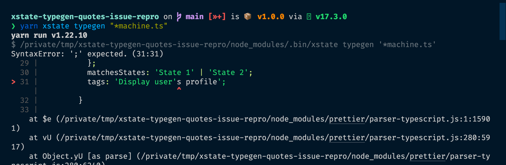

# xstate-typegen-quotes-issue-repro

The VScode extension fails to generate typegen files when **states** or **tags** contain a **single quote**.

The `@xstate/cli` fails too, and gives some information on the reason.



Command run to produce the screenshot:

```sh
yarn xstate typegen "*machine.ts"
```
